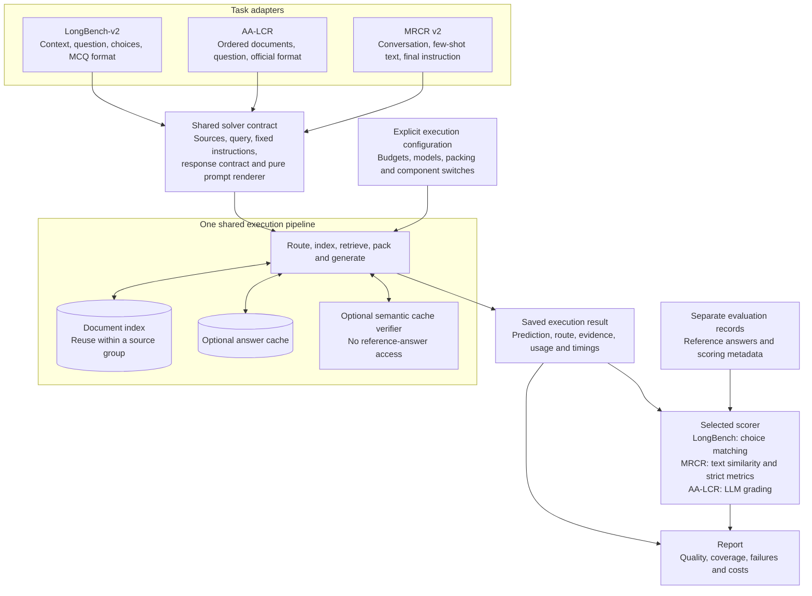
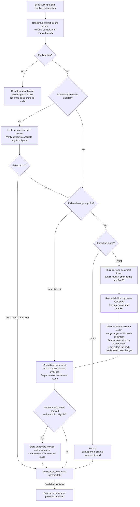

# Shared execution architecture

**Implemented for direct and dense hybrid execution** for LongBench-v2's
OpenAI-compatible path, AA-LCR, and MRCR v2. Select `--execution-profile common`
explicitly; existing entry points retain legacy defaults. See the
[shared execution runbook](jarvis/SHARED_EXECUTION_RUNBOOK.md) for commands and
remaining limitations.
See the [implementation plan](shared_execution_pipeline_plan.md) for migration
steps, legacy configurations, and acceptance tests.

## Component boundaries

Every adapter supplies the same solver contract. The engine does not branch on
benchmark names. Scoring is separate and optional for tasks without references.

The adapter's renderer formats engine-selected evidence; it cannot select or
reorder evidence. References and gold positions stay outside the solver, cache,
and verifier. Scoring never controls cache writes or feeds back into generation.
The AA-LCR grader and cache verifier are separate roles even if they use the same
model service.

## Request flow

This diagram shows the proposed common profile: exact offsets, source-order
packing with overlap merging, and `unsupported` for direct overflow. Answer-cache
reads and writes are independent switches, both off for primary quality runs.

Runtime failures also produce saved error results; configuration and preparation
errors fail before inference. Unsupported examples have no prediction to score.
Grading failures leave saved predictions available for regrading. Legacy
truncation/rejection policies are explicit reproduction settings, omitted here
to keep the common flow readable.

## What changes between benchmarks

| Changes in the adapter/evaluation layer | Remains the same shared implementation |
|---|---|
| Dataset parsing and example selection | Routing and exact request-budget enforcement |
| Document boundaries and fixed instructions | Chunking, indexing and document-index reuse |
| Prompt wrappers and required output format | Retrieval, optional reranking and evidence selection |
| Scoring rule and reference records | Packing policies, executor calls and cache controls |

For example, AA-LCR can supply several documents and MRCR one conversation to
the same indexer and packer. Ranges retain document IDs and original positions;
overlaps merge only within one document. Fixed instructions and few-shot text
are always outside the retrieval corpus and inside the measured request.

Document-index reuse saves embedding work without reusing answers. Answer caching
can skip generation and is evaluated separately. Neither requires a different
benchmark-specific execution pipeline.
