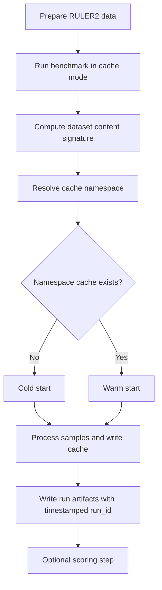

# Data Prep, Cache, and Re-Run Logic

This note explains the benchmark workflow in a presentation-friendly way.

## 1) High-level flow

## 2) Data preparation logic

Data prep creates benchmark input files (tasks and lengths), for example:
- data_8192
- data_32768

Important:
- Folder names are just organization.
- Cache reuse does not rely only on folder name.
- Cache reuse relies on selected sample content signature.

## 3) Cache namespace logic

In cache mode, the runner builds a namespace using:
- corpus id
- selected tasks
- selected lengths
- dataset content signature

Dataset content signature is derived from selected sample fields:
- id
- task
- length
- question
- context
- expected_answer

Then a SHA-256 hash is computed from those normalized records, and a short digest is used in namespace naming.

## 4) Where data is saved

### Run artifacts (always timestamped)
- benchmark_artifacts/official_ruler_v2/<run_id>/
- predictions.jsonl
- bridge_rows.jsonl
- manifest.json

### Persistent cache state (reused across matching runs)
- benchmark_artifacts/official_ruler_v2/cache_state/<namespace>/
- corpus_config.json
- cache_entries.json
- knowledge.json
- cache_idx/
- knowledge_idx/

## 5) Re-run behavior

## 6) Reset behavior

Notes:
- Cache is not auto-deleted when dataset content changes.
- If content changes, a different namespace is selected.
- Old namespace cache remains available for prior content.

## 7) Practical commands

### A) Prepare data

ns prepare_data ruler2 --skip_data_dir_check \
  --setup data_8192 \
  --max_seq_length 8192 \
  --tokenizer_type openai \
  --tokenizer_path cl100k_base \
  --tasks mk_niah_basic mv_niah_basic qa_basic \
  --dataset_size 100

ns prepare_data ruler2 --skip_data_dir_check \
  --setup data_32768 \
  --max_seq_length 32768 \
  --tokenizer_type openai \
  --tokenizer_path cl100k_base \
  --tasks mk_niah_basic mv_niah_basic qa_basic \
  --dataset_size 100

### B) First benchmark run (cold if namespace does not exist)

python ruler_v2/run_benchmark.py \
  --official-prepared-data benchmark_data/ruler2 \
  --official-tasks mk_niah_basic,mv_niah_basic,qa_basic \
  --official-lengths 8192,32768 \
  --mode cache \
  --output-dir benchmark_artifacts

### C) Second run with same selected content (warm)

python ruler_v2/run_benchmark.py \
  --official-prepared-data benchmark_data/ruler2 \
  --official-tasks mk_niah_basic,mv_niah_basic,qa_basic \
  --official-lengths 8192,32768 \
  --mode cache \
  --output-dir benchmark_artifacts

### D) Force cold run for this namespace

python ruler_v2/run_benchmark.py \
  --official-prepared-data benchmark_data/ruler2 \
  --official-tasks mk_niah_basic,mv_niah_basic,qa_basic \
  --official-lengths 8192,32768 \
  --mode cache \
  --official-cache-reset \
  --output-dir benchmark_artifacts

## 8) What to show as evidence in reports

From manifest.json:
- cache_reuse.cache_namespace
- cache_reuse.dataset_signature
- cache_reuse.cache_load_successes
- cache_reuse.cache_entries_before_run
- cache_reuse.cache_entries_after_run
- cache_reuse.cache_hit_rate

From bridge_rows.jsonl:
- from_cache
- cache_type
- latency_ms
- delta_calls
- delta_cost_usd

These fields demonstrate cold vs warm behavior quantitatively.
